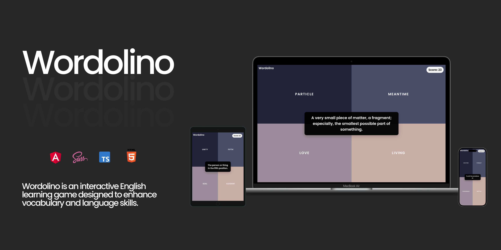

Wordolino is an interactive English learning game designed to enhance vocabulary and language skills. Leveraging modern web technologies like Angular and TypeScript, the application offers engaging word challenges where players match definitions with the correct words. The gamified approach makes learning both fun and effective for users of all ages.

## Features

- **Interactive Gameplay:** Multiple-choice questions with dynamic word definitions.
- **Audio Support:** Automatically plays pronunciation audio (when available) for reinforcing pronunciation.
- **Real-Time Scoring:** Score persistence through cookies ensures players track their progress.
- **Responsive Design:** Seamlessly adapts to both desktop and mobile devices.
- **Randomized Word Selection:** Uses a large word pool for varied challenges.

## Installation & running

Execute following commands to run the application.

```bash
git clone git@github.com:mkamburdev/Wordolino.git
cd Wordolino
npm install
ng serve
```

1. Open your browser and navigate to `http://localhost:4200/`
2. The application will automatically reload if you change any of the source files

## Used technologies

- Angular (Latest Version)
- Angular CLI
- TypeScript
- Angular Material
- RxJS
- HTML & SCSS
- [freeDictionaryAPI](https://github.com/meetDeveloper/freeDictionaryAPI)

## TODO

- Add German version
- Expand game modes and introduce new challenges
- Implement leaderboards and social sharing capabilities
- Add authentication and user profiles